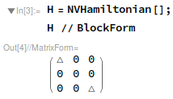
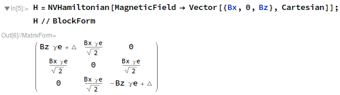
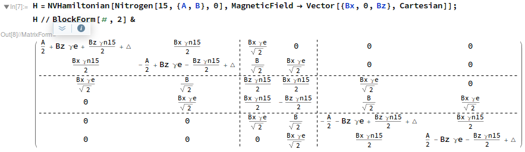
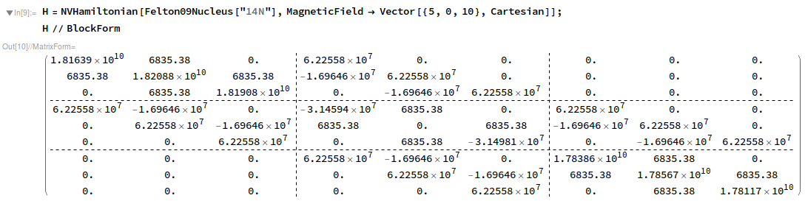
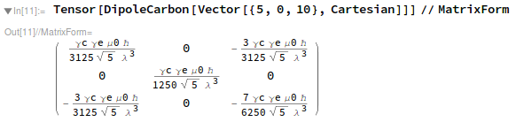
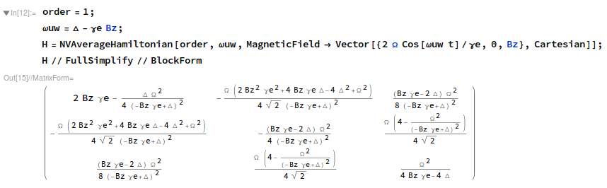
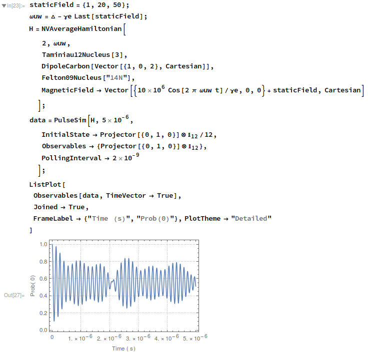

Dependencies
-----------------------------------------------------------

This package is known to run on Mathematica 11, though earlier versions to about 9 should 
also work (untested).
This package requires [Quantum-Utils](https://github.com/QuantumUtils/quantum-utils-mathematica).

Installation
-----------------------------------------------------------

To install this library, just open up `Install.m` in 
Mathematica and goto

    Evaluation > Evaluate Notebook

Explanation of installation for those interested:
This installer simply moves the contents of the 
`src` folder into the search path of Mathematica,
which in this case, is the Applications subfolder of 

    $UserBaseDirectory

On Mac and Linux, simlinks are used for the convenience 
of developing code in `src`.
On Windows, we do an actual copy.

To uninstall, go to `$UserBaseDirectory/Applications` in 
your file explorer and delete the relevant files.

Documentation
-----------------------------------------------------------

Though it is relatively feature-rich and runs smoothly, 
the documentation is severely limited. See the examples, 
read the source code, and feel free to help out.

Many functions will have (terse) doc strings attached, which can 
be viewed by prepending a question mark to the function 
name and running the cell:

    ? Nitrogen
    
Usage: Constructing Hamiltonians
-----------------------------------------------------------

Import a package:

	Needs["NVHamiltonian`"]

Create a trivial Hamiltonian:

Create a Hamiltonian with a static magnetic field in cartesian coordinates of the principle axis:

Create a Hamiltonian including a 15-Nitrogen atom:

Create a numerical Hamiltonian including the 14-Nitrogen tensor as measured by [Felton '09](https://doi.org/10.1103/PhysRevB.79.075203):

Compute the hyperfine tensor of a 13-Carbon located at the coordinate [5,0,10] (in units of atomic bond lengths) coupled by dipole-dipole interaction (assuming NV is a point):

Compute the average (stroboscopic) Hamiltonian at order-1 of an NV. Here we see the Bloch-Siegert shift.
You can throw anything you want into this up to order-2; this example is simple for brevity.

Use `PulseSim` from `QuantumUtils` to simulate an NV connected to two 13-Carbons and a 14-Nitrogen under the
second order average Hamiltonian, with a microwave field a 5MHz. One carbon has a hyperfine tensor as 
measured by [Taminiau '12](https://doi.org/10.1103/PhysRevLett.109.137602).

